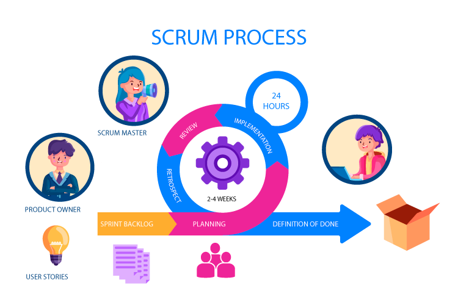
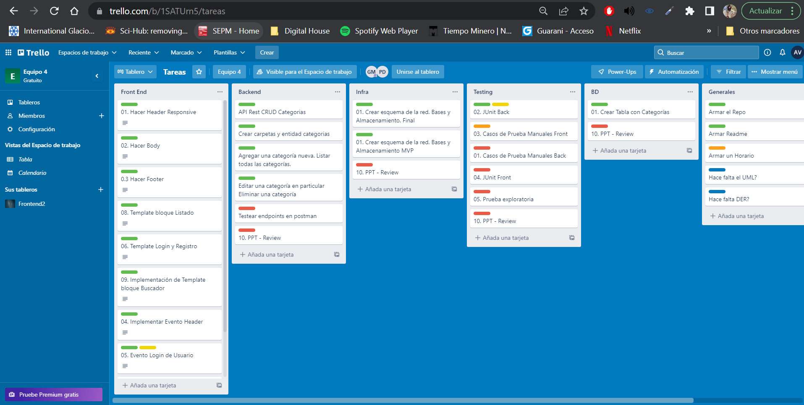
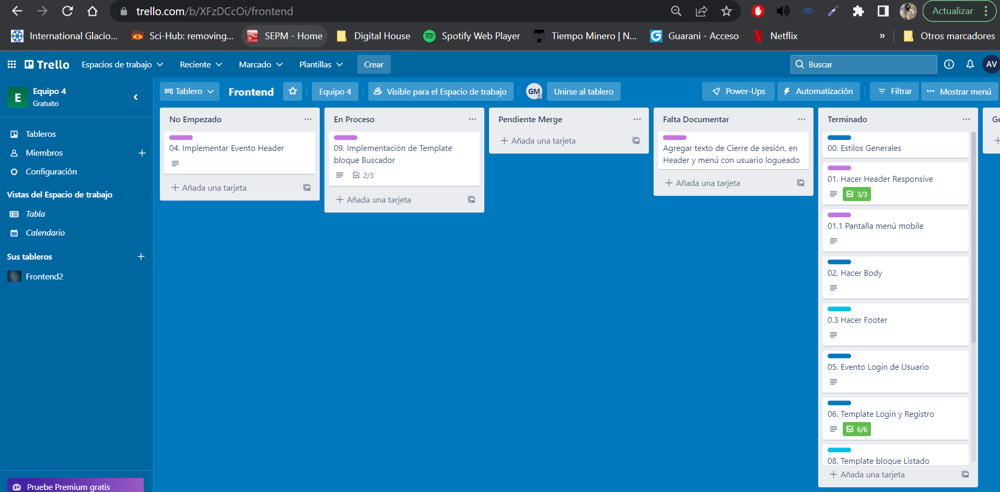
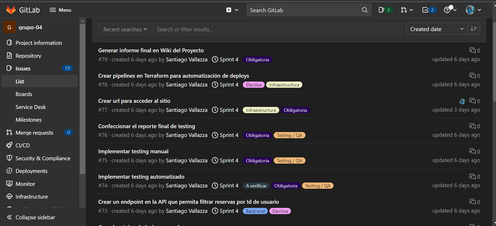

Completar esta sección respondiendo a las siguientes consignas:

**Breve explicación de la metodología de trabajo utilizada (Scrum), indicando los puntos que les hayan resultado positivos y / o negativos.**

## Scrum
- Se utilizó la metodología de trabajo Scrum con los roles de Product Owner (Gerardo Griera) y Tech Leader (Oscar Mellizo Angulo) ocupados por docentes de DH, el rol de Scrum Master a cargo de nuestra tutora Yu Barrios, y el equipo de desarrollo conformado por los miembros de este equipo (Equipo 4).

- Lo más destacado fue la experiencia de trabajo dentro de un equipo de desarrollo y la continua comunicación con el scrum master, rol que fue excelentemente desempeñado por nuestra tutora Yu Barrios. Los puntos más débiles estuvieron en las reviews, las cuáles se hicieron muy largas para todos los participantes, quizás estas ceremonias se podrían haber organizado de manera mas ágil para aprovechar la instancia de feedback y observar de manera mas atenta el trabajo de otros grupos.

**Explicación de cómo manejaron la asignación de roles dentro del equipo (si los hubo) y cómo se organizaron a la hora de repartir las tareas.**

## Asignación de roles
- Durante las primeras reuniones de equipo luego de la presentación del primer sprint cada uno se presentó y dio a conocer sus habilidades técnicas y con que rol se sentia mas cómodo. A partir de esto dividimos el equipo en dos grupos de tres personas, un equipo de front, un equipo de back, las tareas de testing, infraestructura y base de datos se realizaron en conjunto durante el primer sprint. A partir del segundo sprint se asignó el rol de infraestructura a un miembro del equipo y las demás tareas siguieron de manera similar.

## División de tareas
- Para el primer sprint se utilizó el software Trello, allí generamos un tablero con las tareas correspondientes a cada área y que miembro del equipo se encargaria de esta.

- A medida que crecia el número de tareas se decidió utilizar un tablero para las tareas de front, un tablero para las tareas de back y las demás tareas en un tablero general.

- A partir del sprint 2 se dividieron las tareas utilizando  las **Issues** de gitlab, nos pareció la manera más rápida y sencilla de dividir las tareas.

**Opcionalmente pueden describir otros acuerdos a los que hayan llegado para trabajar en equipo, gestionar el control de versiones, normalizar el código producido, etc.**

## Gitlab
- Se decidió trabajar cada issue del proyecto en una rama distinta, luego de probar cada implementación se mergea a la rama develop, la cuál contiene todo el código en etapa de desarrollo pero que ha sido testeado antes de enviarse a la rama main.