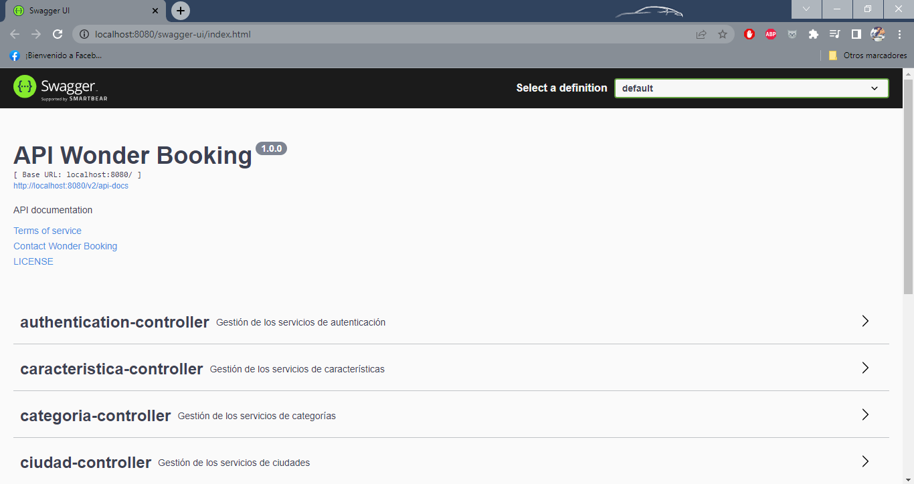

## Índice

- [Sprint I](#sprint-i)
- [Sprint II](#sprint-ii)
- [Sprint III](#sprint-iii)
- [Sprint IV](#sprint-iv)


### Sprint I

- Se crea la base de datos en MySQL con su respectiva tabla de `categoria`.
- Se crea el proyecto en Spring Boot implementando una arquitectura por capas: `Entity`, `Repository`, `Service`, `ServiceImp` y `Controller` inicialmente.
- Se realiza la conexión entre la API y la base de datos en el `application.properties`.

```
# Connection to database
spring.jpa.database=mysql
spring.jpa.show-sql=true
spring.jpa.hibernate.ddl-auto=update

# Database information
spring.datasource.driver-class-name=com.mysql.cj.jdbc.Driver
spring.datasource.username=root
spring.datasource.password=******
spring.datasource.url=jdbc:mysql://localhost:3306/agencia_inmobiliaria
```

- Se crea la capa `DTO`.
- Se crean los endpoints de categoría: `crearCategoria` - `obtenerCategorias` - `eliminarCategoria` - `actualizarCategoria`.
- Se realizan los `test` de services, se adjunta imagen de la estructura de uno de estos test. 


- Se implementa la librería Swagger para documentar los modelos, dto y controladores de la API.



### Sprint II

- Se crean las entidades producto, imagen, ciudad, característica, reserva y política.
- Se crean sus respectivos servicios y controladores.
- Realizamos un DTO para producto para recibir los datos y otro para enviarlos. 
- Se crea el controller de reservas con query params para poder devolver las reservas según las fechas de check in y check out.

### Sprint III

- Se crean las entidades `usuario` y `rol` para definir los datos para el login y así mismo sus respectivos permisos por `rol`.
- Se configura la seguridad de la API con Spring Security y Json Web Token, parametrizando el valor de la Key y el Tiempo del token en el `application.properties`.

```
# Properties for JSON web token
app.jwt-secret-key=****
app.jwt-expiration-token-milliseconds=3600000
```
- Se crea la clase `AuthorizationFilter` para validar que el token ingresado por el usuario sea válido, si lo es se cargan los permisos a la sesión delo usuario logueado.
- Se crea la clase `ConfigurationUserDetailsService` en la cual buscamos a un usuario válido con su email, así mismo se carga su email, password y roles.
- Se crea la clase `HandlerAuthenticationEntryPoint` la cual funcionará como excepción para notificar a los usuarios que no tienen permiso para acceder a los recursos.
- Se crea la clase `SecurityConfig` para deshabilitar la autenticación por defecto de Spring Security y configurar la nuestra, así mismo configuramos las URL que no requieren autenticación para la zona pública de la página. 
- Se crea la clase `SecurityConstants` donde se definen las constante de seguridad con el header, tipo de token, etc.
- Se crea la clase `TokenService` donde se realiza la lógica para crear el token.
- Se realiza la integración de la API SendGrid para el envío de correos electrónicos al momento del registro del usuario con el fin de enviar un mensaje de bienvenida. Se define en `application.properties` la key para consumir la API y el ID de la plantilla del correo.

```
# Api key sendgrid
sendgrid.api.key=****
sendgrind.template.id=****
```

### Sprint IV

- Se realiza el servicio para consultar las reservas que haya realizado un usuario, así mismo se crea su controlador para ser consumido como servicio REST.
- Se realizan los servicios para modificar el producto, buscar por ID de producto y listar todos los productos, así mismo se crean sus respectivos controladores para ser consumidos como servicios REST.