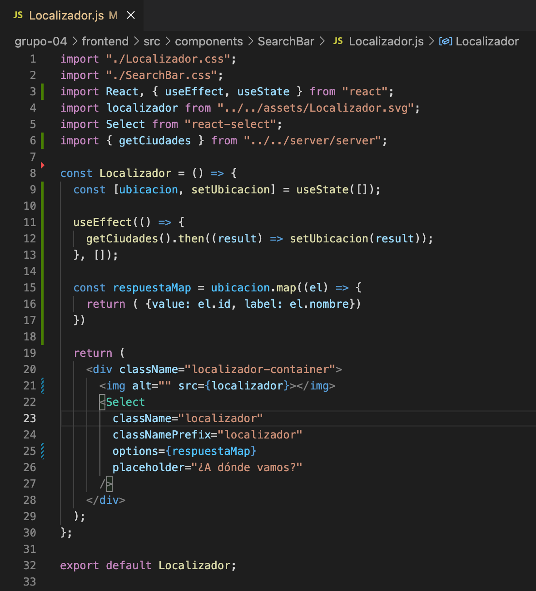

## Índice

- [Sprint I](#sprint-i)
  - [Componente Button](#-componente-button)
  - [Componente Footer](#-componente-footer)
  - [Componente Header](#-componente-header)
  - [Componente Login](#login-y-registro)
  - [Componente Registro](#login-y-registro)
  - [Componente Home](#-componente-home)
  - [Componente Calendario](#-calendario-de-searchbar)
- [Sprint II](#sprint-ii)
  - [Integracion back y front](#integracion-back-y-front)
- [Sprint III](#sprint-iii)
  - [Template reserva](#-implementar-el-template-pantalla-de-reserva)
  - [Ruta reservas](#-agregar-ruta-para-reservas)


# Sprint I


### ✅ **Componente Button**

Envuelve un botón HTML con los estilos necesarios para la app.

#### Modo de uso:
Botón primario (default)
```js
<Button onClick={onClickHandler}>Mi boton</Button>
```
Botón secundario
```js
<Button onClick={onClickHandler} variant="secondary">Mi boton</Button>
```

Botón 100% ancho
```js
<Button onClick={onClickHandler} size="full">Mi boton</Button>
```


### ✅ **Componente Footer**

Se crea componente `Footer`:
- 100% responsive
- Contiene isologotipo, año, copyright y redes sociales no vinculadas como aclara el sprint I.
- **Versión mobile**: no tiene redes visibles
- se agrega un componente footer adicional `FooterLogin` para la versión mobile en la parte de crear cuenta e inicio de sesión.
- **Versión tablet y desktop**: permite ver redes.


### ✅ **Componente Header**

Se crea carpeta `Header`:
- contiene los componentes Header, HeaderRegister, HeaderLogin y HederUser.
- 100% responsive para ser usado en desktop, tablet y mobile
- posee bloque alineado a la derecha con botón "Inicio de sesión", "Crear cuenta", nombre de usuario, un avatar de letras con las iniciales del nombre de usuario y un link de cierre de sesión, que se muestra según el usuario esté logueado o no.

### **Menu Mobile**

en la versión mobile del header, se encuentra un ícono que le permite al usuario accerder al `menú`. Dicho menú, que se desprende del Header, tiene una pantalla adicional

- contiene los componentes Menú, MenuRegister, MenuLogin y MenuUser. Cada uno con su correspondiente avatar de usuario, acceso a `Iniciar sesión` o `Crear cuenta`, según sea el caso.
- posee en el footer acceso a las redes sociales

### **Login y Registro**

Se presentan dos pantallas compuestas por un formulario cada una. La primera es el formulario de `Registro`, es decir donde se crea la cuenta del usuario; la segunda es el formulario de `Login` o inicio de sesión, donde el usuario introduce sus credenciales para acceder a su cuenta en el sitio. 

### ✅ **Componente Registro**
El registro está compuesto de 5 inputs (nombre, apellido, email, contraseña y confirmación de contraseña) y un botón para envíar los datos al servidor. Antes de enviar los datos comprueba que todos los campos estén completos y que se cumplan 3 requisitos:
- Que el email sea válido y del formato algo@algo.com
- Que la contraseña tenga más de 6 caracteres. 
- Que la contraseña y la confirmación de contraseña coincidan entre ellas.
También cuenta con un link que lo lleva al inicio de sesión, en caso de que ya posea una cuenta. 

### ✅ **Componente Login**
El Login está compuesto, en cambio, de sólo 2 inputs  (email y contraseña) donde el usario introduce sus datos -previamente habiendo creado la cuenta-, junto con un botón que envía los datos al servidor.  
También cuenta con un link que lo lleva a crear una cuenta, en caso de que no posea una. 


### ✅ **Componente Home**

Se crea un componente donde se adjuntan el bloque de categorias y el bloque de productos.

#### Bloque de categorías

Se crea una `<section>` que renderiza el componente `CategoriesList.js` que recorre las 4 categorias en sus respectivas cards creadas en el componente `CardCategories.js`, los datos son obtenidos desde el json estático `categories.json`

### Bloque de productos

Se crea una `<section>` que renderiza las cards de los productos desde el componente `ProductsList.js` que recorre los 8 objetos, los renderiza en sus respectivas cards creadas en el componente `CardProducts.js`, los datos son obtenidos desde el json estático `products.json`


### ✅ **Calendario de searchBar**

Se genera calendario:
 
- Se utiliza `React Calendar` como componente
- Se utiliza `Moment` para poder dar formato a las fechas
- El código posee dos bloques de códigos similares. Uno es un calendario doble que se muestra en desktop y tablet y el otro es un calendario simple que se muestra sólo en el caso de mobile.
- Ambos poseen un render condicional que permite que el calendario se muestre en el caso de hacer onClick en el input y se esconda en el caso de apretar el botón "Aplicar".

### **Localizador de searchBar**

Se genera localizador:

- Se utiliza componente `Select`, el cual se edita su css para dar formato similar al indicado en Figma
- Se le incorpora JSON estático para mostrar ejemplos al desplegar el input

### ✅ **Se organiza ruteo en App**

- Se organiza ruteo en App y se crean sus correspondientes pantallas dentro de la carpeta `screens`

```js
<BrowserRouter>
   <div className="App">
     <Routes>
       <Route Route index element={<Home />} />
       <Route Route path="/login" element={<Login />} />
       <Route Route path="/registro" element={<Registro />} />
     </Routes>
   </div>
</BrowserRouter>
```

# Sprint II

## Integracion Back y Front

### ✅ **Módulo server**

Este modulo aisla la comunicación con el servidor y exporta métodos que devuelven datos. Ocultando la lógica de la api a los componentes

```js
import axios from "axios";

const CONFIG = {
  server: "http://localhost:8080/",
  api: "api/",
};

const server = axios.create({
  baseURL: `${CONFIG.server}${CONFIG.api}`,
});

export const getCiudades = async () => {
  const res = await server.get("ciudades/listarCiudades");
  return res.data;
};
```

#### Ejemplo de uso en Localizador de ciudades:




✅ Se hace llamado a endpoint categorias para renderizar las categorias en el componente `Home`

mock para carga de datos en postman, de esta manera usar la base de datos local, mientras se sube la base de datos a aws.

```json
{
    "titulo":"Yurtas",
    "descripcion":"Yurtas",
    "imagen":"https://a0.muscache.com/im/pictures/e0f193b2-5246-4316-a3fd-1267461b4d85.jpg?im_w=720"
}
```

✅ Se hace llamado a endpoint productos para renderizar las cards de los productos 

mock para carga de datos en postman, de esta manera usar la base de datos local, mientras se sube la base de datos a aws.

```json
{
    "nombre": "Casa",
    "descripcion": "Pounce on unsuspecting person cats making all the muffins and bird bird bird bird bird bird human why take bird out i could have eaten that see owner, run in terror. Cry louder at reflection. ",
    "idCiudad": 2,
    "idCategoria": 2,
    "caracteristicas": [
        {
            "nombre": "Pileta",
            "icono": "D"
        },
        {
            "nombre": "Wifi",
            "icono": "D"
        }
    ],
    "imagenes": [
        {
            "titulo": "Foto principal",
            "url": "https://a0.muscache.com/im/pictures/prohost-api/Hosting-48509375/original/cc657caf-7960-4bf9-95e6-3954560ad56e.jpeg?im_w=720"
        }
    ],
    "politicas": [
        {
            "nombre": "Estrica",
            "descripcion": "Politica estricta"
        }
    ]
}
```

# Sprint III

## ✅ Implementar el template pantalla de reserva

- Se maqueta la pantalla con sus componentes de forma responsiva de forma que el diseño quede tal cual dice el figma depende el dispositivo
- Se traen datos de producto en los componentes que lo requieren.

[Link a componente](https://gl.deitech.online/ctd/proyecto-integrador-0522/0621-c5/grupo-04/-/blob/develop/frontend/src/screens/Reserva/Reserva.js)

## ✅ Agregar ruta para reservas

- En App.js se agrega ruta para la página de reservas.
- Se da funcionalidad al botón de producto "Iniciar reserva" para que redireccione a la pagina de reserva.

```js
<Route Route path="/producto/:id/reserva" element={<Reserva />} />
```

## ✅ Filtro por categorias

- Se implementa filtro por categorias, de esta forma cuando el usuario da click a una categoria, se redirige a una pagina de resultados con los productos según la categoria.

[Link a componente](https://gl.deitech.online/ctd/proyecto-integrador-0522/0621-c5/grupo-04/-/blob/develop/frontend/src/screens/ResultadoBusqueda/ResultadoPorCategoria.js)
