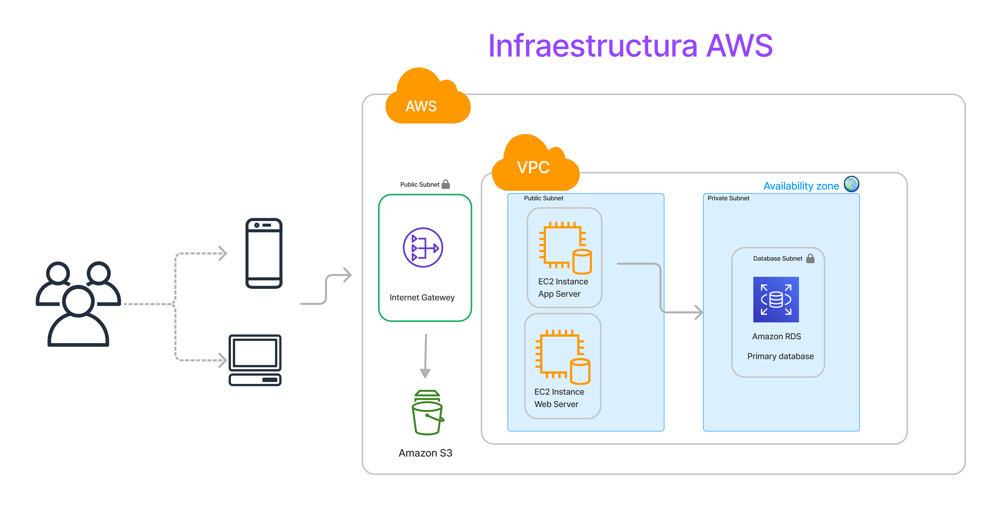

## Índice

- [Sprint I](#sprint-i)
  - [Diagrama MVP](#-diagrama-mvp)
  - [Diagrama final](#-diagrama-final)
- [Sprint II](#sprint-ii)
- [Sprint III](#sprint-iii)
- [Sprint IV](#sprint-iv)

# Sprint I

## ✅ **Diagrama MVP**

## ✅ **Diagrama final**

# Sprint II

## ✅ **Script en Terraform**

## ✅ **Infraestructura en AWS**

## ✅ **Deploy del front en la EC2 Webserver usando Nginx**

# Sprint III

## ✅ **Arquitectura utilizada finalmente**

## ✅ **Deploy del frontend utilizando un bucket S3 y Cloudfront**

## ✅ **Deploy del backend utilizando Elastic beanstalk**

## ✅ **Utilización de RDS en AWS conectada a MySQL Workbench y a la API**

## ✅ **Uso de un bucket S3 para alojar Imágenes e iconos**
