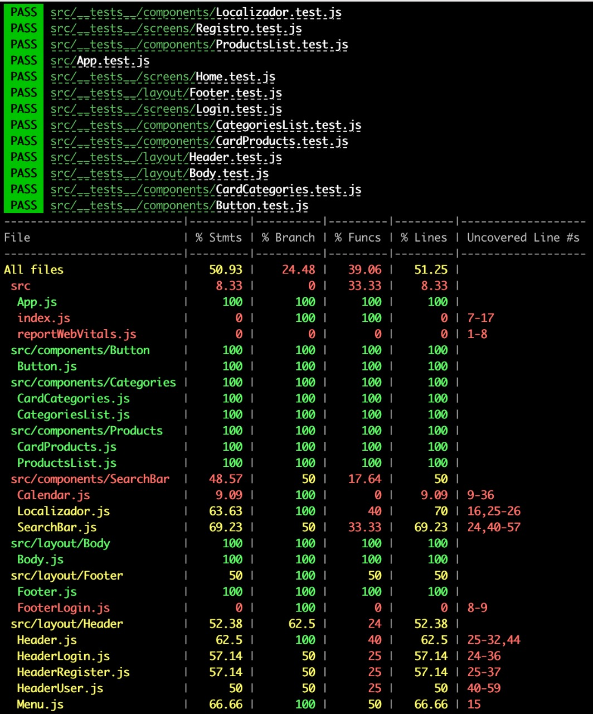
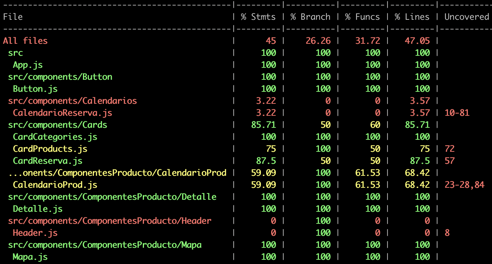
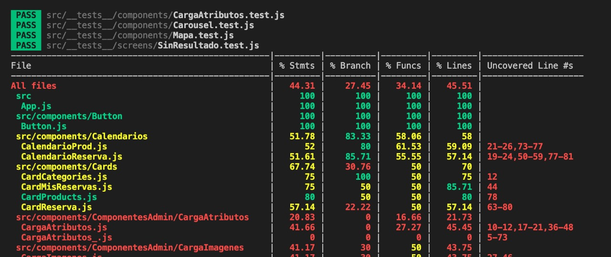

## Índice

**FrontEnd**

- [Sprint I](#sprint-i-f)
  - [Casos de prueba](#-template-casos-de-prueba)
- [Sprint II](#sprint-ii-f)
  - [Cobertura Jest](#-testing-con-jest)
- [Sprint III](#sprint-iii-f)
  - [Cobertura Jest](#testing-con-jest-sprint-iii)
- [Sprint IV](#sprint-iv-f)
  - [Cobertura Jest](#testing-con-jest-sprint-iii)
  - [Informe final de testing](#-informe-final-de-testing)

**BackEnd**

- Sprint I
  - [Casos de prueba](#-template-casos-de-prueba)
- Sprint II
  - [Cobertura Postman](#testing-con-postman)
- Sprint III 
  - [Cobertura Postman](#testing-con-postman)
- Sprint IV
  - [Cobertura Postman](#testing-con-postman)
  - [Suites de regresión]
  - [Informe final de testing](#-informe-final-de-testing)


## Testing - FrontEnd


# Sprint I - F

### ✅ Template casos de prueba

https://docs.google.com/spreadsheets/d/1eTCtrM2b2P8mFgeyjP3hUwF0VdKWmBQ3/edit?usp=sharing&ouid=101192323598024644437&rtpof=true&sd=true


# Sprint II - F

### ✅ **Testing con JEST**

> ### 💡
> Los test se encuentran en la carpeta `__test__` en la rama `testingfront` no se hace merge a otra rama como sugerencia del TL de testing.

- Se instalan las dependencias:

```
npm i --save-dev @testing-library/react react-test-renderer
```

- En directorio `src/` crea carpeta `__tests__` dentro de este directorio hacemos la misma estructura que tiene el proyecto para mantener el orden de los componentes testeados.

- Inicio de pruebas:

  - Se testea componente `Button`

### ✅ Cobertura 40% en test de jest

- Se completa la cobertura requerida para el sprint superando el 40% de los statements.



# Sprint III - F

### **Testing con JEST - Sprint III**

### ✅ Cobertura 40% en test de jest

- Se completa la cobertura requerida para el sprint superando el 40% de los statements.



# Sprint IV - F

### ✅ Cobertura 40% en test de jest



## Testing - BackEnd

# Sprint I - B

### ✅ Validación de API REST en `postman` 

# Sprint II - B

### ✅ Validación de API REST en `postman`. Colecciones subidas en la carpeta “testing/ backend_testing” del proyecto

https://docs.google.com/document/d/1BEtF-aByd8G6wcBdcz5vOje8nTjzSk1JKd23cpvGF8I/edit?usp=sharing

# Sprint IV 

## ✅ **Informe final de testing**

https://docs.google.com/document/d/1uNuOY1eLIG9LdJ8qmv83Y6yixZO_KTf9DrHF73cOVWo/edit